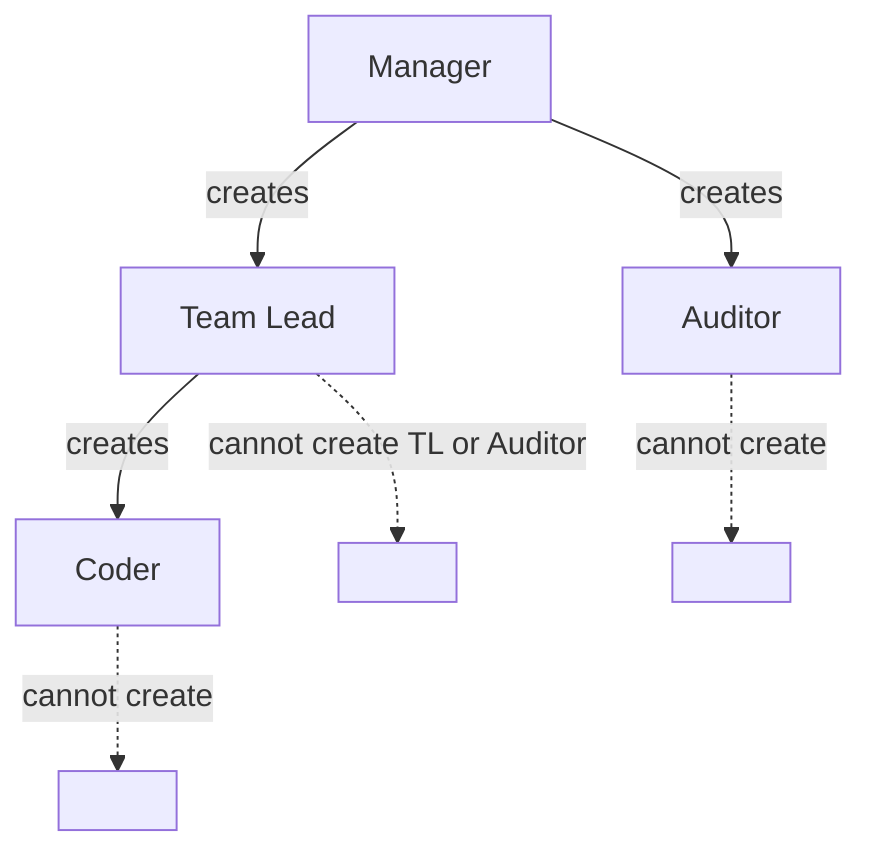
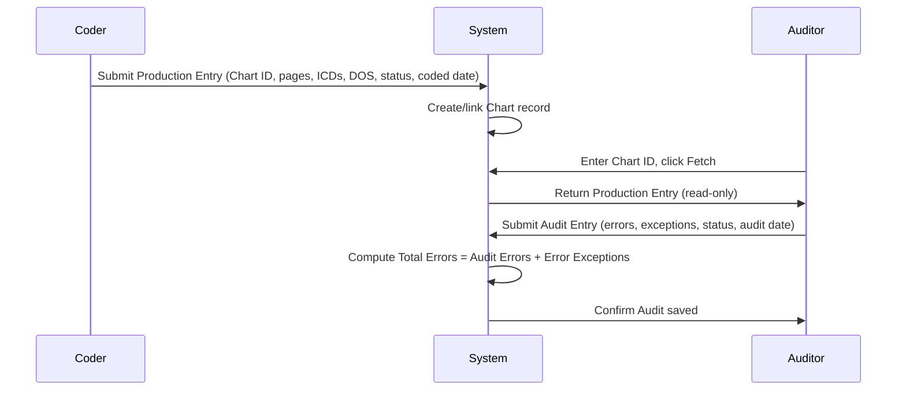

# 01 — Product Architecture

## Purpose

SmartCode is a Medical Coding Production, Audit and Consolidation Platform for SmartClues Technologies LLP. It replaces manual/spreadsheet-based tracking of medical coding production and quality audit with a system where every chart's production and audit history is linked, attributable, and reportable.

## Users & Roles (v1)

| Role | Who they are |
|---|---|
| **Manager** | Owns the operation. Creates Team Leads and Auditors, sees everything. |
| **Team Lead (TL)** | Owns a team of Coders. Creates Coders, monitors team production/productivity. |
| **Coder / Production** | Codes charts. Enters production data against a Chart ID. |
| **Auditor** | Reviews coded charts for quality. Pulls up production by Chart ID, scores it. |

## Account Creation Hierarchy

This is enforced identically on both tiers: the frontend hides/disables actions a role cannot perform, and the backend independently re-validates on every request — the frontend check is a UX convenience, never the security boundary.

## Core Workflow

**Chart ID** is the single linking key across the whole platform. A chart has at most one Production Entry and at most one Audit Entry (v1 assumption — see Open Questions in `10-IMPLEMENTATION-ROADMAP.md`).

The Auditor never retypes anything the Coder already entered — that data flows through the Chart ID lookup, not manual re-entry.

## Version 1 Modules

Authentication · RBAC · Manager Workspace · Team Lead Workspace · Coder Workspace · Auditor Workspace · User Management · Team Management · Chart Management · Production · Audit · Productivity/CPH · Reports · Notifications · Activity Logs · Audit Logs · Settings

**Explicitly out of scope for v1:** CRM, Sales, Payroll, Accounting, mobile application, AI coding suggestions. These are not stubbed, not scaffolded, not referenced in the schema.

## System Boundaries

- SmartCode owns: users, roles, teams, charts, production, audit, productivity, reporting, notifications, activity/audit logging.
- SmartCode does not own: identity federation with external corporate SSO (v1), billing, client-facing portals, EHR/EMR integration.
- File storage (any future attachment/document upload against a chart) lives in S3, referenced by key, not stored in Postgres.

## Major Integrations (v1)

None external. The architecture is Keycloak-ready (see `07-SECURITY-ARCHITECTURE.md`) and export-ready (XLSX/CSV/PDF) but does not integrate with any third-party system in v1.

## Future Extensibility

- **Auth**: native JWT → Keycloak SSO, without touching business logic, if the `AuthProvider` interface boundary (see `06-BACKEND-ARCHITECTURE.md`) is respected.
- **Multi-audit history**: schema can extend `AuditEntry` to a one-to-many relationship against `ProductionEntry` if re-audits become a requirement.
- **Client/Project hierarchy**: `Project` and `Client` entities are included in the schema now (per your entity list) so that charts can later be scoped to a client engagement, even though v1 UI may not fully expose client management.
- **Notifications**: architecture supports adding email/SMS channels behind the existing Notification module without a schema change.
