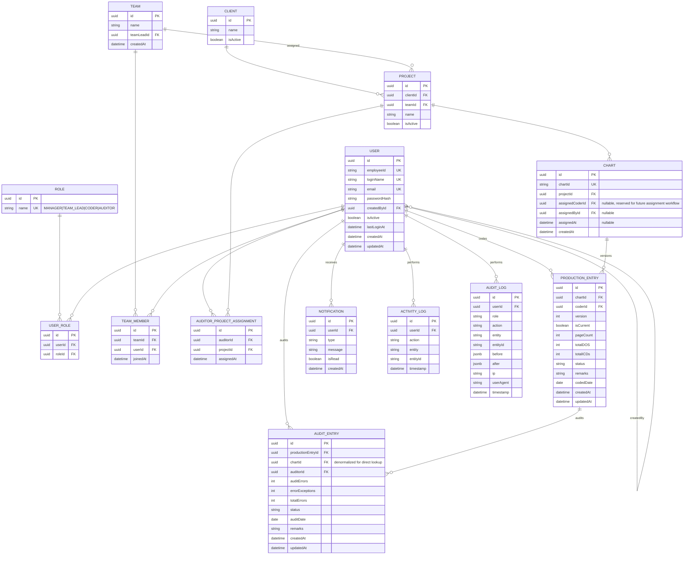

# 02 — Database Design

PostgreSQL, accessed via Prisma. Normalized to 3NF; no JCD field exists anywhere in this schema.

**Updated per `11-SCHEMA-DECISIONS.md` (approved):** Production is versioned (supports rework without restructuring), Audit is 1:N against a Production version (supports re-audit), Chart carries reserved assignment fields, and both status enums are expanded accordingly.

## ERD



## Entity Notes

- **User / Role / UserRole**: unchanged from the original design — many-to-many even though v1 gives each user exactly one role, so the RBAC engine doesn't need a schema change if a future role needs to be composite.
- **Team / TeamMember**: unchanged.
- **Client / Project**: unchanged. A `Project` belongs to a `Client` and is assigned to a `Team`. Charts belong to a `Project`.
- **AuditorProjectAssignment** *(new)*: implements the approved Question 6 decision — an Auditor is scoped to one or more Projects; their queue is derived from this table, not from per-chart assignment.
- **Chart** *(updated)*: now carries `assignedCoderId`, `assignedById`, `assignedAt` — reserved per the approved Question 5 decision. These are nullable and unused by v1 business logic (v1 uses direct Coder entry, auto-creating the Chart), but exist so a future move to formal chart assignment is additive, not a migration.
- **ProductionEntry** *(updated — versioned)*: `chartId` is **no longer unique alone**. `(chartId, version)` is unique, and a partial unique index enforces exactly one `isCurrent = true` row per `chartId`. This is the schema change that makes rework (Question 2) possible without ever overwriting a coder's original submission. Coder identity is still always resolved via join to `User`, never stored redundantly.
- **AuditEntry** *(updated — 1:N against ProductionEntry)*: references `productionEntryId` (the specific version being audited) and denormalizes `chartId` for direct lookup convenience. Multiple `AuditEntry` rows can exist against the same `productionEntryId` over time (re-audit), but v1 business logic only permits a second row once the first's status is `REJECTED` — enforced in the service layer, not by a DB constraint, since the DB can't express "only if the prior row is in this state."
- **ActivityLog vs AuditLog**: unchanged — `ActivityLog` is the lightweight UI feed, `AuditLog` is the compliance-grade append-only log (no `DELETE` for any role).

## Indexes

| Table | Column(s) | Reason |
|---|---|---|
| `Chart` | `chartId` (unique) | Primary lookup key across the whole app |
| `Chart` | `assignedCoderId` | Future assignment queries (reserved) |
| `ProductionEntry` | `(chartId, version)` (unique) | Enforces one row per chart per version |
| `ProductionEntry` | `chartId` (partial unique, `WHERE isCurrent = true`) | Enforces exactly one current version per chart |
| `ProductionEntry` | `coderId` | Coder's own production list |
| `ProductionEntry` | `codedDate` | Date-range report filtering |
| `AuditEntry` | `productionEntryId` | Version-scoped audit lookup |
| `AuditEntry` | `chartId` | Direct chart-based audit lookup |
| `AuditEntry` | `auditorId` | Auditor's own audit list |
| `AuditEntry` | `auditDate` | Date-range report filtering |
| `AuditorProjectAssignment` | `(auditorId, projectId)` (unique) | Prevents duplicate assignment rows |
| `User` | `employeeId` (unique) | Identity lookup |
| `User` | `loginName` (unique) | Login lookup |

## Status Enums (finalized per `11-SCHEMA-DECISIONS.md`)

```
ProductionStatus: PENDING | IN_PROGRESS | COMPLETED | REWORK | CANCELLED
AuditStatus:      PENDING | IN_PROGRESS | COMPLETED | REVIEW_REQUIRED | REJECTED
```

These replace the earlier proposed (and now superseded) 4-value/4-value sets from the original draft of this document. Full transition rules and role-based permissions for each transition are in `09-BUSINESS-RULES.md`.
