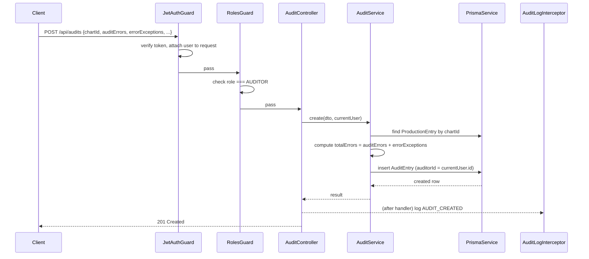

# 06 — Backend Architecture

NestJS, TypeScript, Prisma, PostgreSQL, Redis, BullMQ.

## Module Structure

```
src/
  modules/
    auth/
      auth.module.ts
      auth.controller.ts
      auth.service.ts
      providers/
        auth-provider.interface.ts   # AuthProvider contract
        local-auth.provider.ts       # v1: JWT + bcrypt/argon2
        keycloak-auth.provider.ts    # v2 stub: implements same interface
      strategies/                    # passport-jwt strategy
    users/
    teams/
    charts/
    production/
    audit/
    productivity/
    reports/
      exporters/                     # xlsx, csv, pdf generators, queued via BullMQ
    notifications/
    activity-log/
    audit-log/
  common/
    guards/
      roles.guard.ts
      jwt-auth.guard.ts
    decorators/
      roles.decorator.ts
      current-user.decorator.ts
    interceptors/
      audit-log.interceptor.ts       # writes AuditLog entries for mutating actions
    filters/
      global-exception.filter.ts
    pipes/
      zod-validation.pipe.ts         # (or class-validator, kept consistent w/ shared-types)
  prisma/
    prisma.module.ts
    prisma.service.ts
  main.ts
```

## Auth Provider Abstraction

The single most important structural decision for future Keycloak migration: every module that needs "who is this user" depends on `AuthProvider` (an interface — `validateCredentials()`, `issueTokens()`, `verifyToken()`), not on a concrete JWT implementation. v1 ships `LocalAuthProvider` (bcrypt-hashed passwords in the `User` table, JWT access + refresh tokens). When Keycloak is introduced, `KeycloakAuthProvider` implements the same interface and is swapped in via the Nest DI container — controllers, guards, and business services are untouched.

## Request Lifecycle (example: Auditor submits an audit)



## Background Jobs (BullMQ + Redis)

| Queue | Job | Trigger |
|---|---|---|
| `reports-export` | Generate XLSX/CSV/PDF, upload to S3, notify user when ready | `GET /reports/*/export` |
| `notifications` | Fan out notification on relevant events (e.g., audit completed on a coder's chart) | Domain events (audit created, user deactivated) |

Jobs are chosen for anything that could take more than ~1-2 seconds or that shouldn't block the HTTP response — report generation is the clear v1 case.

## Caching (Redis)

- Session/refresh-token blocklist (for logout / forced invalidation).
- Short-TTL cache for expensive aggregate reads (e.g., Manager analytics dashboard counts) — invalidated on the relevant write, not time-based alone, to avoid showing stale counts after a fresh production/audit entry.

## Validation Strategy

DTOs use `class-validator`/`class-transformer`, generated to stay structurally identical to the Zod schemas in `packages/shared-types` (either hand-kept in sync with a lint rule, or generated from one source — a decision to make in Phase 0 tooling setup). The backend **never trusts frontend-computed values** — `totalErrors` is the canonical example: accepted from the client only for display-echo purposes, always recalculated server-side before persistence, and the write is rejected if the two disagree by more than a rounding-irrelevant integer check.
