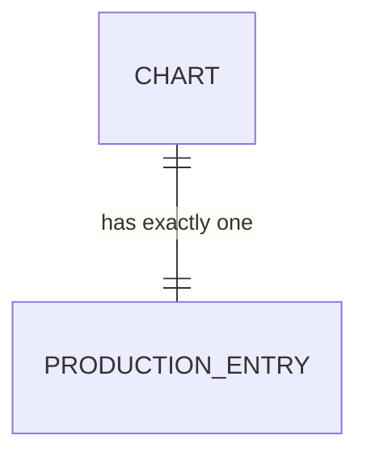
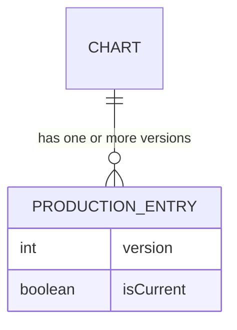
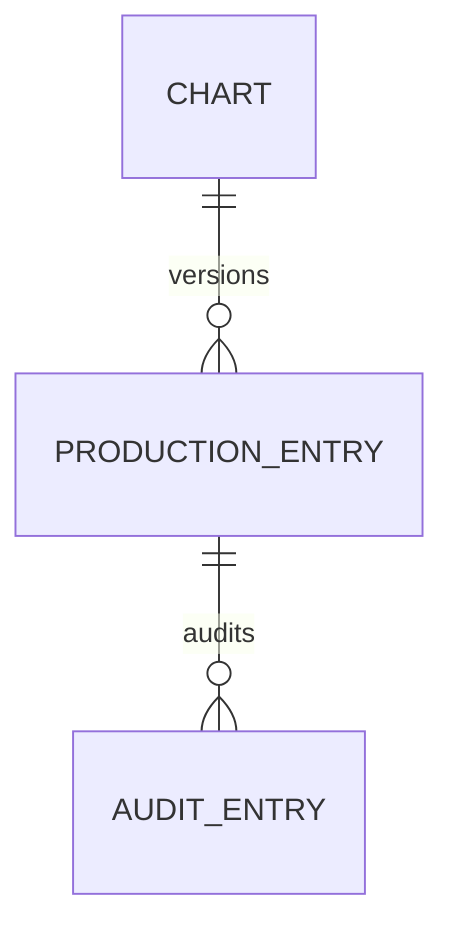
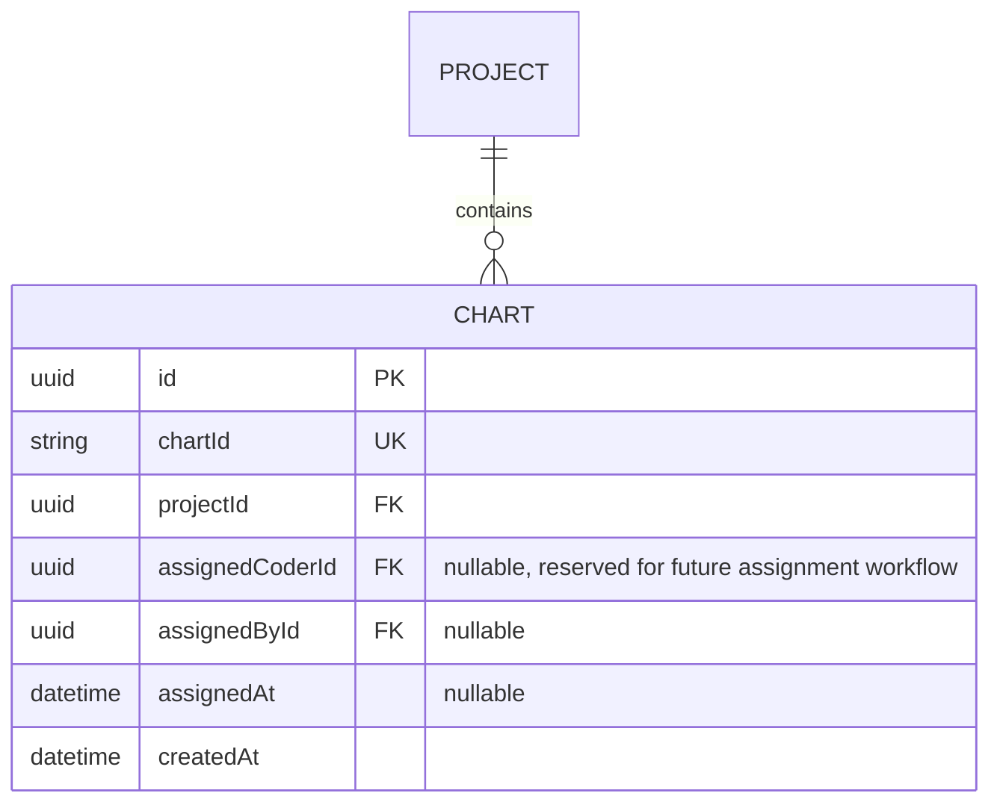
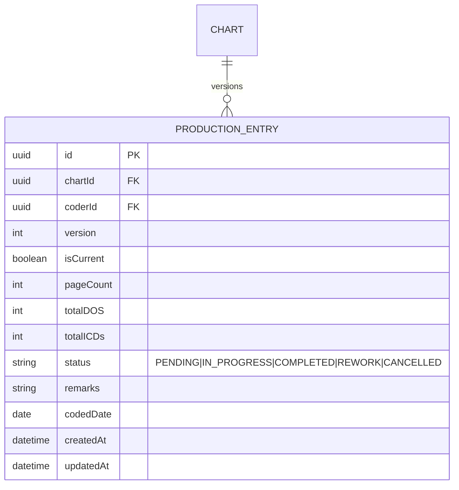
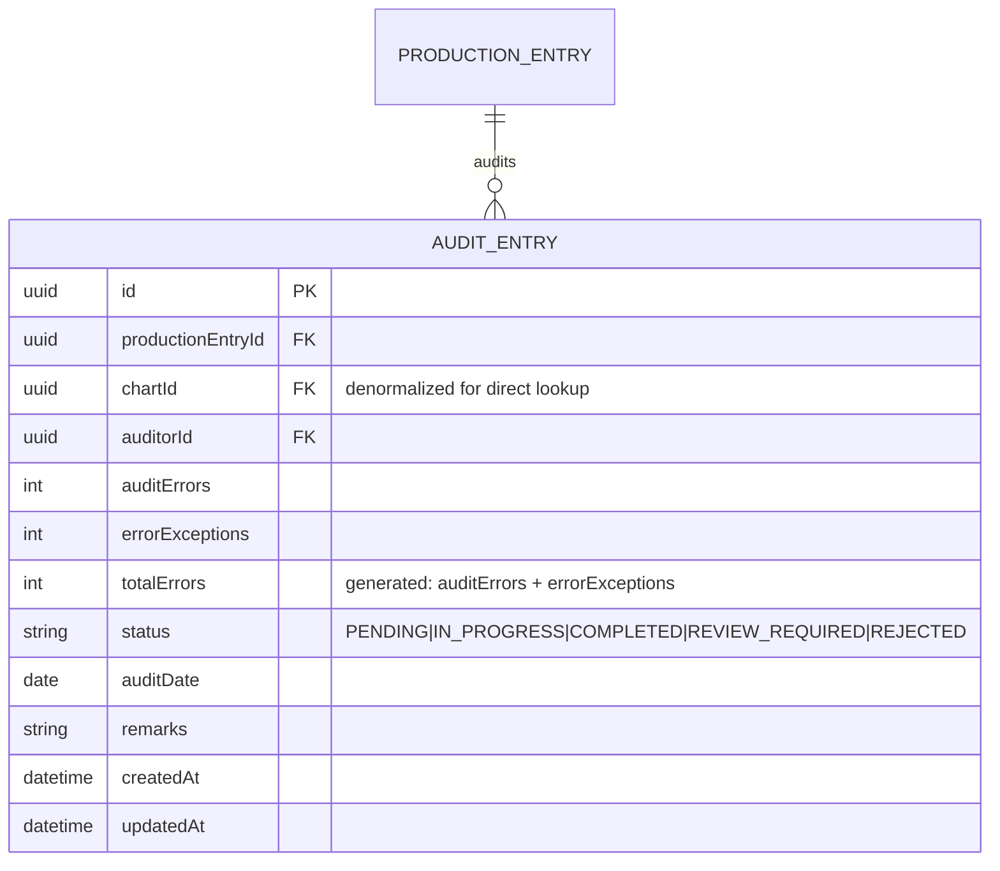
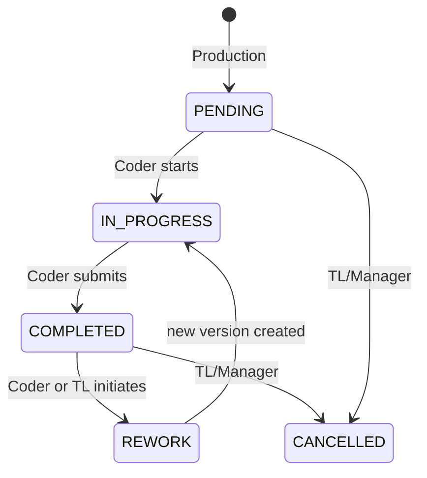
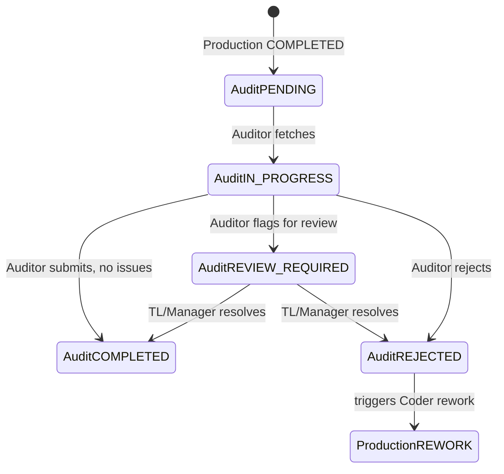
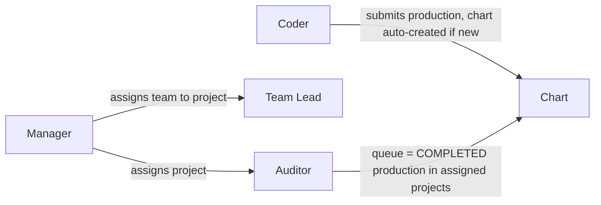

# 11 — Schema-Shaping Decisions (Pending Your Confirmation)

**Status: awaiting approval. No code, no migrations, no Phase 1 work has started.**

This document resolves the 7 open questions from `10-IMPLEMENTATION-ROADMAP.md` with full reasoning, per your request. JCD is not referenced anywhere below, per standing instruction.

---

## Decision Table

| # | Question | Option A | Option B | Technical Impact | Recommended Default |
|---|---|---|---|---|---|
| 1 | Chart lifecycle | One Chart → One Production Entry | One Chart → Multiple Production Versions | B requires a `version` concept now to avoid a breaking migration later | **B (schema), A (v1 workflow)** — see below |
| 2 | Production edit/rework | Direct edit of completed record | New version created on rework, original preserved | B is the only option compatible with audit-trail integrity | **B** |
| 3 | Audit relationship | Production 1:1 Audit | Production Version 1:N Audit | B needed if re-audit/rework is ever supported | **B (schema), constrained to effectively 1:1 in v1 business logic** |
| 4 | Audit statuses | 5-status set incl. `REVIEW_REQUIRED`/`REJECTED` | Minimal 3-status set | More statuses = more UI states, more transition rules to enforce | **5-status set** (justified below) |
| 5 | Chart assignment | Coder direct Chart ID entry (auto-creates Chart) | Manager/TL pre-load & assign charts to Coders | B is more enterprise-realistic but is a bigger v1 scope increase | **A (v1 workflow), with schema fields reserved for B** |
| 6 | Auditor assignment | Auditor searches any Chart ID within their assigned project | Charts explicitly assigned to a specific Auditor | B requires an assignment table + queue-building logic now | **A, scoped by project assignment** |
| 7 | Completed audit / re-audit | Overwrite previous audit | New audit record created, history preserved | A destroys compliance-relevant history | **B** |

The pattern across all seven: **wherever "preserve history" and "allow correction" are in tension, preserve history** — this is a medical-coding QA platform, and audit trail integrity is the product's core value proposition, not an add-on.

---

## 1. Chart Lifecycle

**The question:** Does a Chart have exactly one Production Entry forever, or can a Coder's work on a chart go through multiple versions (e.g., original submission, then a corrected resubmission after rework)?

**Why it matters:** This is the single most consequential schema decision in the whole system. If `ProductionEntry.chartId` is a unique constraint (one-to-one) and you later need rework, you cannot add a second production record for the same chart without either (a) breaking the unique constraint — a real migration touching every query that assumes 1:1 — or (b) faking rework by mutating the original record in place, which destroys the "what did the coder actually submit, and when" history that an auditor's original findings were based on.

**Option A — One Chart → One Production Entry**

Simple. `ProductionEntry.chartId` unique. Breaks the moment rework is needed.

**Option B — One Chart → Multiple Production Versions**

`ProductionEntry.chartId` is **not** unique; instead `(chartId, version)` is unique, and exactly one row per chart has `isCurrent = true` at any time.

**Impact by layer:**

| Layer | Option A | Option B |
|---|---|---|
| PostgreSQL | `UNIQUE(chartId)` on ProductionEntry | `UNIQUE(chartId, version)`, partial index `WHERE isCurrent = true` enforcing exactly one current row per chart |
| Prisma | `Chart` has `production ProductionEntry?` (optional 1:1) | `Chart` has `productionVersions ProductionEntry[]`, app resolves "current" via `isCurrent` |
| API | `GET /charts/:chartId/production` returns the one row | Same endpoint, but resolves `WHERE isCurrent = true` — **no API contract change for the Auditor fetch flow** |
| UI | No version concept anywhere | Coder/TL can optionally see version history; Auditor fetch UI is unchanged (still shows one production panel) |

**Recommendation:** Build the schema as **Option B** from Phase 1, but constrain v1 business logic to behave like Option A — a Coder's normal flow creates exactly one version, and a second version is only created through the explicit rework path (Question 2). This is the "evolve without major restructuring" principle in practice: the Auditor-facing fetch API and UI never change even if rework is introduced in month 3 instead of month 1.

---

## 2. Production Edit / Rework

**The question:** What happens when a Coder needs to correct an already-completed Production record?

**Why it matters:** If a Coder can silently edit a `COMPLETED` record and an Audit already exists against it, the Auditor's findings now describe data that no longer exists — a direct integrity problem for a QA product. If a Coder *cannot* ever correct a mistake, legitimate corrections have no path except a Manager manually touching the database, which is worse.

**Proposed status set:** `PENDING → IN_PROGRESS → COMPLETED`, with `REWORK` and `CANCELLED` as exception paths.

**Who can change status:**

| Transition | Allowed role |
|---|---|
| `PENDING → IN_PROGRESS`, `IN_PROGRESS → COMPLETED` | Coder (own record only) |
| `COMPLETED → REWORK` | Coder (self-initiated correction) **or** TL (directing a correction, e.g. after informal feedback) |
| `REWORK → IN_PROGRESS → COMPLETED` (on the **new version**) | Coder |
| `* → CANCELLED` | TL or Manager only (e.g., chart was miscoded entirely / doesn't belong to this project) |

**Can a Coder edit a completed record directly?** No. Editing content is only allowed while a version's status is `PENDING` or `IN_PROGRESS`. Once `COMPLETED`, the only content-changing path is: set status to `REWORK` → this creates a new `ProductionEntry` version (per Question 1) with the previous version's data pre-filled → Coder edits the new version → submits → new version becomes `COMPLETED` and `isCurrent`; the old version's `isCurrent` flips to `false` but the row is never deleted or overwritten.

**Can a TL edit it directly?** No — a TL can *trigger* rework (change status to signal "this needs correction") but does not edit the Coder's data themselves. This keeps authorship of production data unambiguous, which matters for productivity/CPH attribution.

**Should the system preserve the previous version?** Yes — never deleted, never overwritten. This is what makes Option B in Question 1 necessary rather than optional.

**Should every modification be recorded in the audit trail?** Yes — `PRODUCTION_CREATED`, `PRODUCTION_UPDATED`, and a new `PRODUCTION_REWORK_INITIATED` action are all logged to `AuditLog` with before/after snapshots, consistent with the existing logging architecture in `07-SECURITY-ARCHITECTURE.md`.

---

## 3. Audit Relationship

**The question:** Should Production→Audit stay 1:1, become 1:N, or follow versions (each Production version has its own audit(s))?

**Given the Question 1 decision (versioned Production), the natural extension is:**



Each `ProductionEntry` (version) can have one-or-more `AuditEntry` rows, but **v1 business logic constrains this to effectively one active audit per version**: an Auditor cannot create a second `AuditEntry` against a version that already has an audit in `PENDING`, `IN_PROGRESS`, or `COMPLETED` status (a `409 Conflict`, same enforcement pattern as the original chart-uniqueness rule). A second audit against the *same version* is only possible if the first audit's status is `REJECTED` (see Question 4) — which is what a genuine re-audit-of-the-same-work scenario looks like, versus rework, which creates a *new production version* and therefore a *new* first audit against that version.

**Why this doesn't over-complicate v1:** the API and UI both only ever deal with "the current audit for the current production version" — `GET /charts/:chartId/production` and its paired audit lookup resolve to a single row, exactly as in the original 1:1 design. The 1:N schema is invisible to a v1 user; it only matters the day a second audit event actually happens.

---

## 4. Audit Status

**Proposed minimum set:** `PENDING`, `IN_PROGRESS`, `COMPLETED`, `REVIEW_REQUIRED`, `REJECTED`.

| Status | Meaning | Who can set it |
|---|---|---|
| `PENDING` | Chart is in the Auditor's queue (production is `COMPLETED`, no audit started) | System (auto, when Production hits `COMPLETED`) |
| `IN_PROGRESS` | Auditor has fetched the chart and is actively scoring it | Auditor |
| `COMPLETED` | Audit finished, findings recorded, no further action needed on this chart | Auditor |
| `REVIEW_REQUIRED` | Auditor found issues serious enough that a second reviewer (TL/Manager) should look before it's final | Auditor (sets it), TL/Manager (resolves it back to `COMPLETED` or `REJECTED`) |
| `REJECTED` | Audit findings indicate the production itself needs rework | Auditor or Manager |

**Why 5 and not fewer:** `REVIEW_REQUIRED` is what gives a Manager/TL a QA escalation path without needing a separate "disputes" module — collapsing it into `REJECTED` would conflate "send this back to the coder" with "a second auditor should weigh in," which are operationally different actions with different downstream effects (one creates a Coder task, the other creates a reviewer task).

**Why not more (e.g., splitting `REJECTED` by reason):** rejection *reason* belongs in the existing `Remarks` field, not as additional statuses — that avoids a combinatorial status explosion for something that's really free-text detail, not a workflow state.

**Interaction with Question 2/3:** `REJECTED` is the trigger that makes rework meaningful — a Coder sees "this chart was rejected, rework needed" in their queue, which is what turns Production status into `REWORK` (Question 2) and, per Question 3, opens the door to a new production version and a fresh audit cycle.

---

## 5. Chart Assignment

**The question:** Who creates/imports charts, who assigns them, and what can each role see?

**Option A — matches the workflow described in your original brief (Sections 4, 14, 15):** Charts are not pre-loaded. A Coder directly enters a Chart ID on the Production form; if it doesn't exist yet, the system creates it. No formal assignment step exists.

**Option B — closer to how larger real-world coding operations run:** Charts are imported or created upfront (by Manager, or a future batch-import job) and explicitly assigned to a Coder by a TL before that Coder ever touches them. The Coder's "My Production" queue is then "charts assigned to me," not an open text field.

**Recommendation: Option A for v1 workflow** — it's what your written spec actually describes, and it's a materially smaller build (no assignment UI, no queue-building logic, no "unassigned charts" backlog view). **But reserve the schema now**: add `Chart.assignedCoderId` (nullable) and `Chart.assignedById`/`assignedAt` from Phase 1, unused by the v1 UI. If Option B becomes a real requirement later, it's a UI/API addition, not a schema migration.

**Access boundaries (apply regardless of A or B):**

| Role | Can see |
|---|---|
| Manager | All charts, all projects |
| Team Lead | Charts belonging to projects assigned to their team |
| Coder | Charts they have submitted production against (Option A) — or charts explicitly assigned to them (Option B) |
| Auditor | Charts within their assigned project(s) whose production status is `COMPLETED` (i.e., ready for audit) |

**Can a chart be reassigned?** With the schema fields reserved above, yes — trivially, once Option B logic exists. Not applicable to v1 Option A workflow, since there's no assignment to begin with.

---

## 6. Auditor Assignment

**The question:** Does an Auditor audit any chart in their assigned project, or only charts explicitly assigned to them individually?

**Option A — project-scoped, self-service queue:** Manager assigns an Auditor to one or more Projects. The Auditor's queue (`/auditor/queue`) shows all charts in those projects with Production status `COMPLETED` and Audit status `PENDING`. The Auditor picks up any of them (enters the Chart ID, or clicks from the queue list — same underlying fetch call either way).

**Option B — explicit per-chart assignment:** A Manager or TL assigns specific charts to a specific Auditor. The Auditor's queue only shows charts assigned to *them*, not the whole project's backlog.

**Database/API implications:**

| | Option A | Option B |
|---|---|---|
| Schema | `AuditorProjectAssignment(auditorId, projectId)` join table | Additional `AuditEntry.assignedAuditorId` (or a pre-audit `AuditAssignment` record) set before the Auditor even opens the chart |
| API | `GET /auditor/queue` = charts in my assigned projects, status filter | `GET /auditor/queue` = charts explicitly assigned to me |
| Workload balancing | Auditors self-select, can lead to uneven pickup | Manager/TL controls distribution precisely |

**Recommendation: Option A.** It matches the "Auditor enters Chart ID" workflow in your original spec and the reference image's Audit Queue concept, and it avoids building a second assignment/distribution system on top of the Chart assignment question above. Project-level assignment (`AuditorProjectAssignment`) is a small, genuinely necessary table either way — it's what scopes "all charts" down to "this Auditor's charts" and is needed regardless of which sub-option you pick later.

---

## 7. Completed Audit / Re-audit

**Can a completed audit be edited?** No — once `COMPLETED`, an `AuditEntry` is immutable content-wise, for the same reason Production records are immutable once `COMPLETED` (Question 2): other things (reports, CPH/accuracy metrics, potentially a Coder's rework decision) may already depend on that recorded state.

**Who can edit it?** No one, directly. A correction path exists only through explicit re-audit (below), never through mutating history.

**Can a chart be audited again?** Yes, in two distinct scenarios that should not be conflated:
1. **Rework cycle** (Question 2/3): Coder reworks → new Production version → new Audit naturally follows, against the new version. This is not "re-auditing the same work," it's auditing new work.
2. **Genuine re-audit of the same production version** (e.g., a QA spot-check disagrees with the original Auditor's findings): this is a new `AuditEntry` row against the *same* `ProductionEntry` version.

**Overwrite or preserve?** **Preserve (Option B).** A new `AuditEntry` row is created; the original is never overwritten or deleted. This is important for three concrete reasons specific to a medical coding QA platform:
- **Accuracy/CPH metrics** are often computed from audit history — silently overwriting a past audit would retroactively change an Auditor's or Coder's historical accuracy numbers, which is both a data-integrity problem and, in a compliance context, a defensibility problem ("what did the audit say at the time" needs to be answerable).
- **Auditor performance tracking** — Manager-level oversight of Auditor consistency depends on being able to see what the original finding was, not just the final one.
- **Dispute resolution** — if a Coder or TL disputes an audit finding, the original record needs to still exist to have a dispute about.

---

## Recommended Models

### 1. Recommended Chart Model



### 2. Recommended Production Model


Constraint: `UNIQUE(chartId, version)`; partial unique index ensuring exactly one `isCurrent = true` row per `chartId`.

### 3. Recommended Audit Model



### 4. Recommended Status Transitions





### 5. Recommended Assignment Workflow



### 6. Recommended RBAC Impact

Two additions to the matrix in `03-RBAC-PERMISSIONS.md`:

| New Permission | Manager | Team Lead | Coder | Auditor |
|---|:---:|:---:|:---:|:---:|
| Initiate Rework (`COMPLETED → REWORK`) | ✅ | ✅ (own team) | ✅ (own record) | ❌ |
| Resolve `REVIEW_REQUIRED` audit | ✅ | ✅ (own team's charts) | ❌ | ❌ |
| Cancel Production/Chart | ✅ | ✅ (own team) | ❌ | ❌ |

No other rows in the existing matrix change.

### 7. Recommended Prisma Relationship Structure (illustrative — not final code)

```prisma
model Chart {
  id              String   @id @default(uuid())
  chartId         String   @unique
  projectId       String
  assignedCoderId String?
  assignedById    String?
  assignedAt      DateTime?
  createdAt       DateTime @default(now())

  project         Project           @relation(fields: [projectId], references: [id])
  productionEntries ProductionEntry[]
}

model ProductionEntry {
  id         String   @id @default(uuid())
  chartId    String
  coderId    String
  version    Int      @default(1)
  isCurrent  Boolean  @default(true)
  pageCount  Int
  totalDOS   Int
  totalICDs  Int
  status     ProductionStatus @default(PENDING)
  remarks    String?
  codedDate  DateTime
  createdAt  DateTime @default(now())
  updatedAt  DateTime @updatedAt

  chart      Chart        @relation(fields: [chartId], references: [chartId])
  coder      User         @relation(fields: [coderId], references: [id])
  auditEntries AuditEntry[]

  @@unique([chartId, version])
  // partial unique index on (chartId) WHERE isCurrent = true — added via raw migration
}

model AuditEntry {
  id                String   @id @default(uuid())
  productionEntryId String
  auditorId         String
  auditErrors       Int
  errorExceptions   Int
  totalErrors       Int      // recomputed server-side on every write
  status            AuditStatus @default(PENDING)
  auditDate         DateTime
  remarks           String?
  createdAt         DateTime @default(now())
  updatedAt          DateTime @updatedAt

  productionEntry   ProductionEntry @relation(fields: [productionEntryId], references: [id])
  auditor           User            @relation(fields: [auditorId], references: [id])
}

enum ProductionStatus {
  PENDING
  IN_PROGRESS
  COMPLETED
  REWORK
  CANCELLED
}

enum AuditStatus {
  PENDING
  IN_PROGRESS
  COMPLETED
  REVIEW_REQUIRED
  REJECTED
}
```

---

## What this changes in the previously delivered documents

If you approve the above, these documents need a corresponding update before Phase 1: `02-DATABASE-DESIGN.md` (ERD, entity notes, enum lists), `03-RBAC-PERMISSIONS.md` (the two new permission rows), `04-API-ARCHITECTURE.md` (rework/re-audit endpoints), `09-BUSINESS-RULES.md` (rework/re-audit rules), `10-IMPLEMENTATION-ROADMAP.md` (assumptions/open-questions section resolved). I have not edited them yet — waiting for your confirmation on each of the 7 decisions above, in case you want to adjust any default before I propagate the changes.

**No code. No Phase 1. Waiting on your confirmation.**
